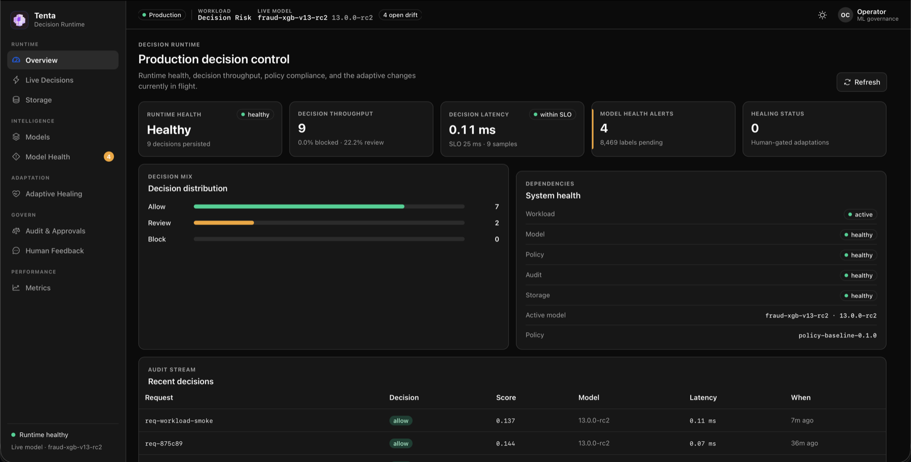

<p align="center">
  
</p>

# Tenta

[](https://github.com/kossisoroyce/Tenta/actions/workflows/ci.yml)
[](https://www.python.org/downloads/)
[](LICENSE)
[](ROADMAP.md)

Tenta is an open-source Decision Runtime for high-stakes machine learning. It
wraps production models with policy enforcement, workload-specific validation,
human feedback, drift monitoring, adaptive healing, storage provisioning, and
tamper-evident audit trails.

Fraud is the first reference workload, not the boundary. The same runtime shape
applies to credit, insurance, healthcare, identity, AML, cybersecurity, quality
inspection, and other production decision systems where every automated decision
needs context, control, and a durable record.



## What Exists Now

- Python runtime package and `tenta` CLI.
- Stdlib HTTP API for decisions, health, audit, workload control, feedback,
  drift, model operations, healing actions, and database provisioning.
- App-facing serving endpoint discovery for the live Timber-backed champion
  model.
- Generic `decision_risk` workload plus a `payment_fraud` reference workload.
- Workload import/export, activation, validation, sample payloads, and replay
  fixtures.
- Timber artifact manifest registration with hash/signature/workload/replay
  promotion gates.
- SQLite-first persistence with optional local Postgres provisioning.
- Hash-chained decision and operation ledgers.
- Persistent control-plane state for models, drift, healing, feedback,
  benchmarks, policy history, and runtime controls.
- React, TypeScript, Vite, and Kumo dashboard served by the runtime.

Production inference is designed to pair with
[Timber](https://github.com/kossisoroyce/timber), an AOT compiler for
dependency-free classical ML artifacts. The current local backend uses a
deterministic rule-based model wrapper so the runtime can be developed and
tested without external model infrastructure.

## Quick Start

```bash
git clone https://github.com/kossisoroyce/Tenta.git
cd Tenta
python3 -m venv .venv
source .venv/bin/activate
pip install -e .
python3 -m unittest discover -s tests
```

Build the dashboard and start the runtime:

```bash
cd dashboard
pnpm install
pnpm build
cd ..
tenta serve --host 127.0.0.1 --port 8080
```

Open [http://127.0.0.1:8080/](http://127.0.0.1:8080/) for the dashboard.

During local development you can also run without installing:

```bash
PYTHONPATH=runtime python3 -m tenta_runtime serve --host 127.0.0.1 --port 8080
```

## Make A Decision

When a Timber artifact is promoted to champion, apps call Tenta's governed
decision endpoint rather than a raw model server. That stable endpoint keeps
policy, audit, idempotency, workload validation, and rollback in the path.

```bash
tenta model register examples/decision-risk-v14.tenta.json --url http://127.0.0.1:8080
tenta model promote decision-risk-xgb-v14 --stage champion --url http://127.0.0.1:8080
tenta endpoint --url http://127.0.0.1:8080
```

```bash
tenta decide --sample --url http://127.0.0.1:8080
```

Or call the API directly:

```bash
curl -s http://127.0.0.1:8080/v1/decision-requests \
  -H 'Content-Type: application/json' \
  -d @examples/decision_request.json
```

The response includes the normalized request id, model score, allow/review/block
decision, policy reason codes, latency, model metadata, and audit fields.

## Use The Python Library

```python
from tenta_runtime import RuntimeEngine, RuleBasedModelWrapper

engine = RuntimeEngine(model=RuleBasedModelWrapper())
result = engine.score(
    {
        "decision_request_id": "req-python-001",
        "subject_id": "subject-001",
        "amount": 120.0,
        "currency": "USD",
        "context_id": "checkout",
        "channel": "api",
        "requested_at": "2026-07-11T12:00:00Z",
        "features": {
            "entity_risk": 0.18,
            "velocity_10m": 2,
            "subject_age_days": 180,
            "prior_adverse_events": 0,
            "high_risk_segment": False,
        },
    }
)

print(result["decision"], result["score"])
```

Application client:

```python
from tenta_runtime import TentaClient

client = TentaClient("http://127.0.0.1:8080")
print(client.endpoint()["url"])
decision = client.decide(
    {
        "decision_request_id": "req-app-001",
        "subject_id": "subject-001",
        "context_id": "checkout",
        "value": 120,
        "currency": "USD",
        "channel": "api",
        "requested_at": "2026-07-11T12:00:00Z",
        "features": {
            "entity_risk": 0.18,
            "velocity_10m": 2,
            "subject_age_days": 180,
            "prior_adverse_events": 0,
            "high_risk_segment": False,
        },
    }
)
```

## CLI Surface

```bash
tenta health --url http://127.0.0.1:8080
tenta endpoint --url http://127.0.0.1:8080
tenta model register examples/decision-risk-v14.tenta.json --url http://127.0.0.1:8080
tenta model promote decision-risk-xgb-v14 --stage champion --url http://127.0.0.1:8080
tenta decisions --limit 10 --url http://127.0.0.1:8080
tenta decision req-001 --url http://127.0.0.1:8080
tenta audit verify --url http://127.0.0.1:8080
tenta operations --limit 20 --url http://127.0.0.1:8080
```

Workloads are first-class:

```bash
tenta workload list --url http://127.0.0.1:8080
tenta workload active --url http://127.0.0.1:8080
tenta workload sample decision_risk --url http://127.0.0.1:8080
tenta workload validate --payload examples/decision_request.json --url http://127.0.0.1:8080
tenta workload export decision_risk --output decision-risk.json --url http://127.0.0.1:8080
tenta replay list
tenta replay run --url http://127.0.0.1:8080
```

Storage can be provisioned from the CLI or dashboard using the same runtime API:

```bash
tenta db status --url http://127.0.0.1:8080
tenta db provision-sqlite --path data/tenta.sqlite3 --url http://127.0.0.1:8080
pip install -e '.[postgres]'
tenta db provision-postgres --url http://127.0.0.1:8080
```

## API Highlights

| Method | Path | Purpose |
| --- | --- | --- |
| `GET` | `/v1/health` | Runtime and dependency health |
| `GET` | `/v1/serving-endpoint` | Current app-facing model endpoint |
| `POST` | `/v1/decision-requests` | Score and persist a decision |
| `GET` | `/v1/decision-requests/{id}` | Fetch a decision trail |
| `GET` | `/v1/overview` | Dashboard overview payload |
| `GET` | `/v1/models` | List registered models |
| `POST` | `/v1/models/register` | Register a Timber artifact manifest |
| `POST` | `/v1/models/{id}/promote` | Promote a model after gates pass |
| `GET` | `/v1/workloads` | List packaged and imported workloads |
| `POST` | `/v1/workloads/import` | Import a workload spec |
| `POST` | `/v1/workloads/activate` | Switch the active workload |
| `GET` | `/v1/audit/integrity` | Verify decision and operation hash chains |
| `POST` | `/v1/database/provision` | Provision SQLite/Postgres or connect storage |
| `POST` | `/v1/feedback` | Record human outcome feedback |
| `POST` | `/v1/drift/events` | Ingest a drift signal |

See [docs/api/12-api-reference.md](docs/api/12-api-reference.md) for the deeper
contract and [runtime/README.md](runtime/README.md) for implementation details.

## Repository Layout

```text
Tenta/
├── dashboard/              # React/Kumo operator console
├── docs/                   # Architecture, API, security, deployment notes
├── examples/               # Runnable payloads and integration examples
├── runtime/tenta_runtime/  # Python runtime package
├── tests/                  # Runtime, API, storage, audit, CLI tests
├── compose.yaml            # Local Postgres service for provisioning
└── pyproject.toml          # Python package metadata
```

## Development

```bash
python3 -m unittest discover -s tests
cd dashboard
pnpm install
pnpm build
```

Local runtime state is stored in `data/` by default and ignored by Git. The
dashboard build output is also ignored; rebuild it after cloning before serving
the production dashboard from the runtime.

## Documentation

- [Documentation map](docs/README.md)
- [Runtime guide](runtime/README.md)
- [Dashboard guide](dashboard/README.md)
- [Roadmap](ROADMAP.md)
- [Security policy](SECURITY.md)
- [Contributing guide](CONTRIBUTING.md)

## Project Status

Tenta is pre-release. The core engine, local dashboard, storage provisioning,
workload registry, app-facing serving endpoint discovery, replay fixtures, and
audit integrity checks are working. The next major push is hardening the
extension surface: production model adapters, packaging polish, SDK ergonomics,
signed artifact loading, deeper benchmarks, and deployment automation.

## License

Apache License 2.0. See [LICENSE](LICENSE).
