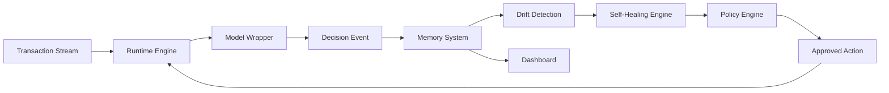

# 02 - System Architecture

The platform is organized around a transaction scoring runtime, model wrapper, memory system, drift detection service, self-healing engine, policy engine, dashboard, SDK, and deployment controller.

## High-Level Flow

## Components

- Runtime Engine: low-latency scoring path for transactions.
- Model Wrapper: stable interface around fraud models.
- Memory System: durable store for decisions, feedback, drift signals, and interventions.
- Drift Detection: monitors distribution shift and performance degradation.
- Self-Healing Engine: proposes corrective actions.
- Policy Engine: approves, rejects, or escalates healing actions.
- Dashboard: operator, analyst, and model-risk visibility.
- SDK: extensions for models, detectors, policies, and data connectors.

## Architectural Constraint

The live scoring path must stay small, predictable, and resilient. Expensive analysis, training, and research workflows should run outside the synchronous scoring path.

