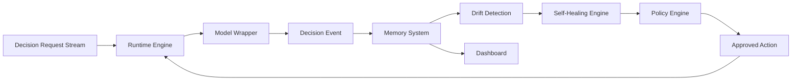

# 02 - System Architecture

Tenta is organized around a workload-aware decision runtime, model wrapper,
Timber-based compiler path, memory system, drift detection service, adaptive
healing engine, policy engine, dashboard, SDK, and deployment controller.

## High-Level Flow

## Components

- Runtime Engine: low-latency scoring path for decision requests.
- Model Wrapper: stable interface around production models.
- Compiler Service: builds Timber-compiled, signed C99 inference artifacts from trained models. See [Timber Compiler Integration](03a-timber-compiler.md).
- Memory System: durable store for decisions, feedback, drift signals, and interventions.
- Drift Detection: monitors distribution shift and performance degradation.
- Self-Healing Engine: proposes corrective actions.
- Policy Engine: approves, rejects, or escalates healing actions.
- Dashboard: operator, analyst, and model-risk visibility.
- SDK: extensions for models, detectors, policies, and data connectors.

## Architectural Constraint

The live scoring path must stay small, predictable, and resilient. Expensive analysis, training, and research workflows should run outside the synchronous scoring path. Serving models as AOT-compiled Timber artifacts (rather than as Python model servers) is how the platform meets this constraint without giving up auditability.
