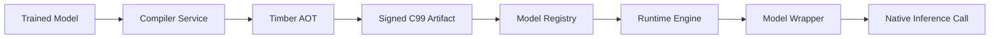

# 03a - Timber Compiler Integration

The platform uses [Timber](https://github.com/kossisoroyce/timber) as the ahead-of-time (AOT) compiler for all production fraud models. Timber compiles classical ML models — XGBoost, LightGBM, scikit-learn, CatBoost, ONNX — into signed, dependency-free C99 inference code that the runtime loads and calls directly.

## Why Timber Fits This Platform

Fraud detection in high-frequency transaction systems is dominated by tree ensembles and linear models, exactly the model families Timber targets. The platform's constraints and Timber's strengths overlap tightly:

| Platform constraint | Timber capability |
|---|---|
| Bounded p99 / p99.9 latency on the scoring path | Native C99 inference, ~336× faster than Python; no interpreter or GC in the hot path |
| Deterministic behavior for audit | AOT-compiled artifact; no JIT variance, no framework version drift |
| Signed model artifacts before production use | Built-in Ed25519 signing |
| Immutable, small deployable artifacts | ~48 KB artifacts; trivial to store, diff, and cache |
| Air-gapped / regulated environments | Air-gapped deployment bundles; no runtime Python dependency |
| Safety and worst-case timing evidence | WCET analysis; DO-178C / ISO-26262 / IEC-62304 report generation |
| Fast fallback swap during a healing action | Load a second signed shared library and repoint the wrapper |

## Where Timber Sits in the Architecture

Timber replaces the "Python model server" that would otherwise sit behind the model wrapper. The wrapper's shape does not change — it still exposes `load`, `predict`, `health`, `explain`, and `shadow_predict` — but the underlying call is a native function into a Timber-compiled `.so` / `.dylib`.

## Build Pipeline

The Compiler module (see [compiler/](../../compiler/README.md)) runs this pipeline whenever a new model version is promoted:

1. **Load** the trained model plus its feature contract, calibration table, and target policy.
2. **Parity check.** Score a golden dataset with both the source model and the Timber-compiled model. Reject if per-record scores diverge beyond a configured tolerance.
3. **Compile** with Timber. Select the appropriate backend:
   - `timber` core for portable C99.
   - `timber accel` for AVX2 / AVX-512 / NEON / SVE / RVV SIMD when the runtime host supports it.
   - CUDA / Metal / OpenCL for GPU-served scoring paths (e.g. large batch replay / backtests).
4. **Package** the artifact bundle:
   - Compiled shared library.
   - Feature contract (input schema + normalization).
   - Calibration table.
   - Bound policy manifest reference.
   - WCET / timing report.
   - Build provenance (source model hash, training data hash, compiler version).
5. **Sign** the bundle with Ed25519. Push to the model registry.

## Runtime Loading

The runtime performs signature verification on artifact load. A failed verification prevents the artifact from becoming active; the runtime falls back to the last-good signed artifact and emits a degraded-decision event.

Hot-swap during a self-healing action is a pointer flip between two loaded shared libraries. The wrapper serializes swap points to keep in-flight scoring on a consistent artifact.

## Explainability

Timber-compiled tree ensembles expose per-tree paths, which the wrapper aggregates into the `explanations` field of the prediction contract. When richer attribution is needed (e.g. for analyst review of a specific decision), the wrapper can fall back to running SHAP on the source model out-of-band — this is off the synchronous scoring path.

## Online Learning Interaction

Timber artifacts are immutable by design. Online learning does **not** mutate a live Timber artifact. Instead:

- The online learner produces candidate updates in a shadow path.
- Approved candidates are re-compiled by Timber into a new signed artifact.
- Promotion to production goes through the same signing, parity, and policy gates as any other model change.

This preserves the platform's audit story: every production decision is traceable to a specific signed artifact hash.

## Certification Path

For regulated deployments (payments, banking, insurance underwriting), the Timber-emitted DO-178C / ISO-26262 / IEC-62304 report is attached to the artifact bundle and stored in the model registry alongside the signature. Auditors receive the artifact hash and its accompanying certification report.

## Non-Goals

- Timber is not used for deep-learning fraud models. If a future model requires DL, it is served through a separate wrapper implementation; the rest of the platform (memory, drift, policy, healing) is unchanged.
- Timber is not the training system. It is invoked only after training is complete and validation has passed.
